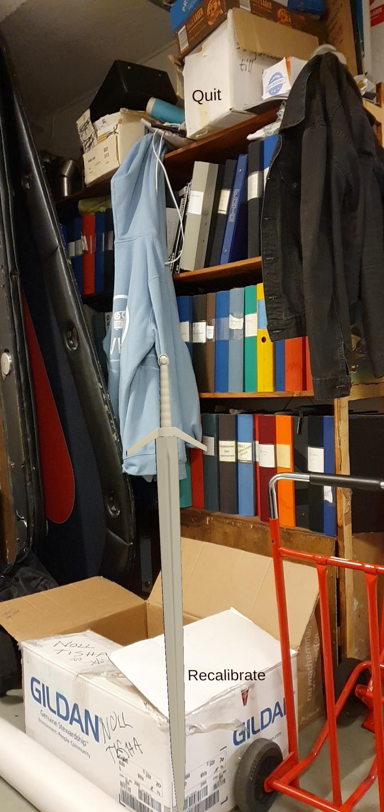
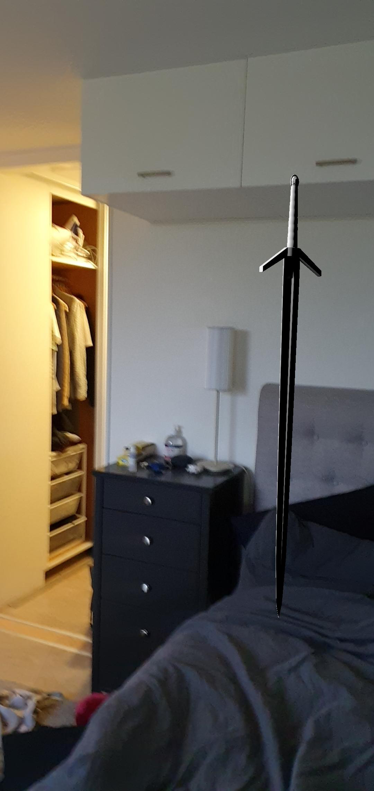
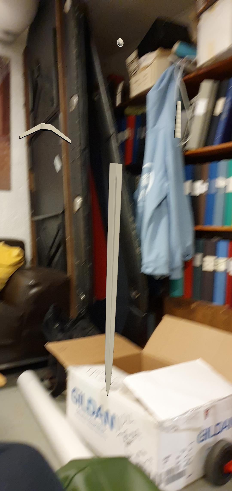

# AR-test
An ARCore project that generates an object within the camera of a smart phone to create a augmented reality feel, also includes unity animation to create a dismantle and build effect to the object.

The Object that is generated takes in where the user is looking before allowing them to tap on the screen to place the object.

